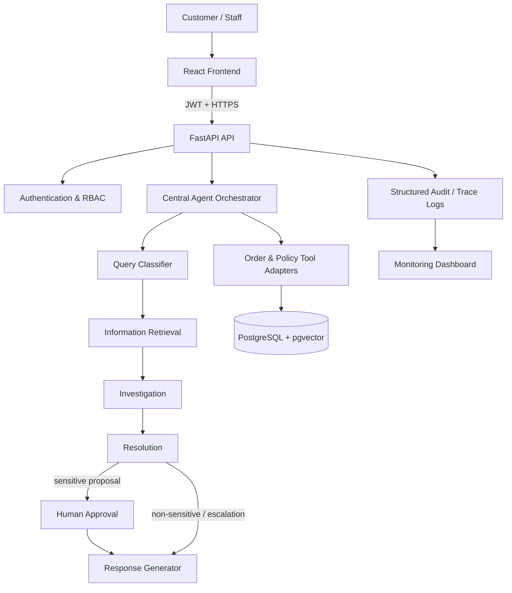
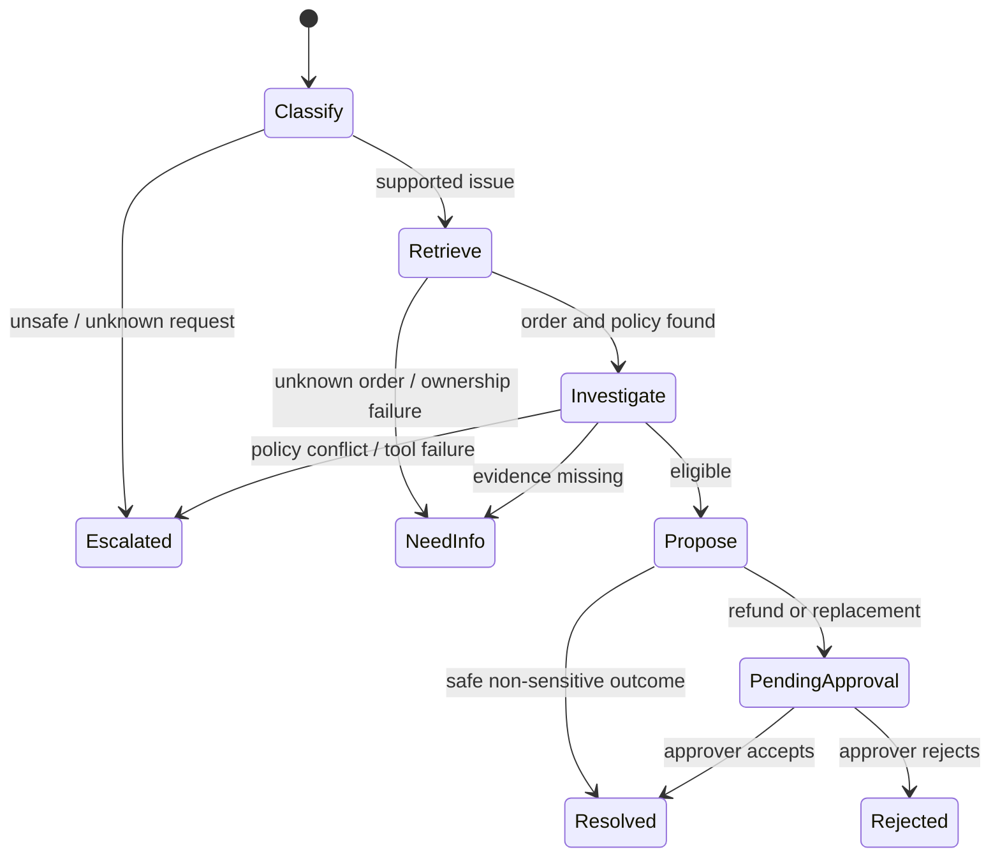
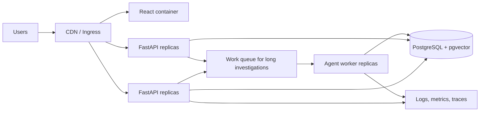

# Capstone Deliverables — ResolveAI

**Student:** Santhosh K · **Roll No:** 2023103552

This document presents the five required enterprise-architecture deliverables for the Multi-Agent Customer Support & Resolution Assistant.

## 1. Architecture diagram

**Trust boundaries:** Browser-to-API traffic is authenticated; the API alone accesses the database and tools; the orchestrator uses narrow tool adapters; only the human-approval API can change a pending sensitive decision to resolved. In the demonstration build, mock records replace external commerce systems.

## 2. Agent workflow design

Each transition writes an execution trace. The run has a maximum of six agent stages and a tool-call deadline. A failed or timed-out tool creates an escalation rather than a retry loop. Classification, retrieval, investigation, and proposal are distinct functions/nodes, which makes their permissions and logs independently reviewable.

## 3. Deployment strategy

For local delivery, Docker Compose runs frontend, backend, and PostgreSQL. In production, the API is stateless and horizontally scalable, while a queue/worker tier processes longer investigations. Use managed PostgreSQL backups, migration jobs, secret manager injection, readiness probes, autoscaling on CPU/queue depth, canary releases, and a separate production environment.

## 4. Security model

| Area | Control | Implementation in this build |
|---|---|---|
| Identity | JWT authentication | Signed bearer token issued after demo login |
| Access | RBAC and ownership isolation | Customers view their own tickets; only approvers act on proposals |
| Input | Validation and injection defense | Pydantic constraints, order-ID regex, suspicious-instruction escalation |
| Agents | Least privilege | Only tool adapter functions receive order/policy access; no approval tool exists for agents |
| Privacy | Data minimisation | Retrieval requires matching customer ID and returns a narrow order record |
| Secrets | External configuration | `.env.example`; no secrets in source |
| Audit | Immutable-style event trail | Events capture ticket, actor, action, metadata and UTC time |
| LLM safety | Output is advisory | Deterministic policy checks enforce actions independently of any model output |

## 5. Monitoring dashboard design

The dashboard exposes business, technical, and governance metrics:

| Panel | Metrics | Alert / use |
|---|---|---|
| Workflow health | ticket count, terminal status distribution, success rate | Detect stalled/excess escalations |
| Performance | average workflow duration, API latency, tool success rate | Detect degraded dependencies |
| Agent quality | classification outcomes, missing-evidence rate, trace failures | Improve prompts/policies safely |
| Safety & governance | approval queue age, rejection rate, injection escalations | Identify risky requests or bottlenecks |
| Cost | estimated tokens and cost per workflow | Set budget thresholds |
| Audit | approval history and sensitive actions | Support investigation and compliance |

The shipped UI computes dashboard values from ticket and audit records rather than displaying only fixed mock values.
