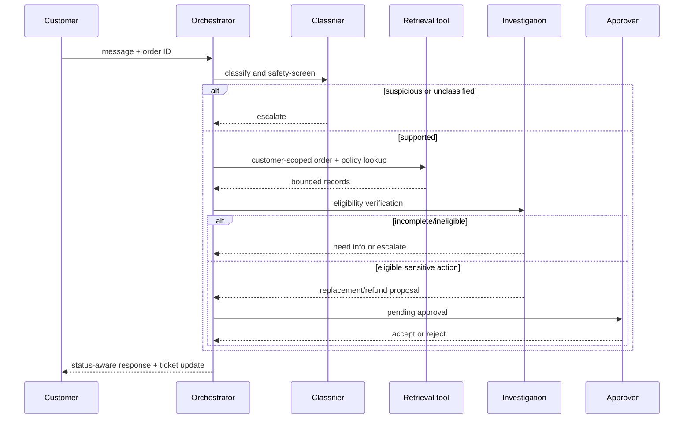

# Agent Workflow

## State and handoffs

## Node contract

| Node | Inputs | Output | Permission |
|---|---|---|---|
| Query Classifier | validated customer message | issue type, action, priority, unsafe flag | no tools |
| Information Retrieval | customer ID, validated order ID, issue type | scoped order and policy data | read-only adapters |
| Investigation | retrieved records | eligibility, missing evidence, escalation reason | no tools |
| Resolution | investigation finding | proposed action and next status | cannot execute action |
| Human Approval | ticket, approver identity, note | final approve/reject decision | approver/admin only |
| Response Generator | final ticket state | customer-facing explanation | no tools |

## Failure paths and bounded execution

The state machine has a six-step maximum. Each node records a trace record. An unsupported intent, suspicious instruction, absent policy, or tool failure becomes an `ESCALATED` ticket. A missing order/evidence result becomes `NEEDS_INFORMATION`. No node retries itself indefinitely; production tool adapters should use short timeouts, a limited retry policy for transient failures, circuit breakers, and dead-letter handling for asynchronous jobs.
