\# AEGISDESK — Agentic IT Support Demonstrator


\## Capstone Deliverables


\*\*Student:\*\* R. Harsanth

\*\*Register Number:\*\* 2023103565

\*\*Project:\*\* AEGISDESK — Agentic IT Support Demonstrator


\---


\# 1. Architecture Diagram


\## 1.1 Architecture Overview


AEGISDESK is designed as a layered agentic IT support architecture. The system separates user interaction, request orchestration, knowledge retrieval, policy enforcement, tool execution, human approval, and observability.


The demonstrator currently uses local knowledge and simulated IT tools. Enterprise integrations are represented as controlled future adapters so that the architecture can evolve without allowing the prototype to accidentally perform real administrative actions.


\## 1.2 Architecture Diagram


```mermaid

flowchart TB

&#x20;   U\[Support User / Staff] --> UI\[AEGISDESK Web UI]


&#x20;   subgraph APP\["Trust Boundary: AEGISDESK Application Runtime"]

&#x20;       UI --> API\[FastAPI API]


&#x20;       API --> ORCH\[Agent Orchestrator]


&#x20;       ORCH --> P\[Planner / Router]


&#x20;       P --> R\[Knowledge Retrieval]

&#x20;       R --> KB\[(Local Support Knowledge)]


&#x20;       ORCH --> PG\[Policy \& Guardrail Gate]


&#x20;       PG --> T\[Simulated IT Tools]


&#x20;       T --> WIFI\[Wi-Fi Diagnostic]

&#x20;       T --> VPN\[VPN Diagnostic]

&#x20;       T --> ACC\[Account Status]

&#x20;       T --> TKT\[Simulated Ticketing]


&#x20;       PG --> AQ\[(Approval Queue)]

&#x20;       AQ --> OP\[Authorized Human Approver]


&#x20;       ORCH --> RESP\[Response Composer]


&#x20;       ORCH --> AUD\[(Audit / Request Events)]


&#x20;       API --> OBS\[Metrics / Health / Audit APIs]

&#x20;       OBS --> MON\[Operations Dashboard]

&#x20;   end


&#x20;   subgraph EXT\["External Integration Boundary"]

&#x20;       SYS\[Future Enterprise Systems]

&#x20;   end


&#x20;   T -. "Future controlled adapters" .-> SYS

```


\## 1.3 Architectural Layers


\### Layer 1 — Experience Layer


The web interface provides the support interaction surface.


Responsibilities:


\* submit support requests;

\* display agent responses;

\* display retrieved evidence;

\* display workflow traces;

\* provide access to the operations dashboard;

\* display pending approval requests.


\### Layer 2 — API Layer


The FastAPI service provides the application interface.


Responsibilities:


\* receive requests;

\* validate request payloads;

\* expose chat functionality;

\* expose approval APIs;

\* expose audit and metrics APIs;

\* expose health information;

\* serve the frontend.


\### Layer 3 — Agent Orchestration Layer


The orchestration layer coordinates the agent workflow.


Major components:


\* Planner/Router;

\* Knowledge Retriever;

\* Policy Gate;

\* Tool Executor;

\* Response Composer.


This separation makes it possible to enforce policy before an action reaches a tool.


\### Layer 4 — Knowledge Layer


AEGISDESK uses a local internal support knowledge base containing guidance for:


\* Wi-Fi troubleshooting;

\* VPN access;

\* account recovery;

\* support tickets.


The knowledge layer provides supporting evidence for the response rather than allowing the agent to rely only on free-form generation.


\### Layer 5 — Tool Layer


The demonstrator provides simulated tools for:


\* Wi-Fi diagnostics;

\* VPN diagnostics;

\* account status;

\* ticket creation.


The simulated tools intentionally do not contact external enterprise systems.


\### Layer 6 — Governance Layer


The governance layer provides:


\* policy checks;

\* protected-action detection;

\* approval gating;

\* human authorization;

\* safe failure behavior;

\* audit events.


Sensitive actions cannot bypass this layer.


\### Layer 7 — Observability Layer


The system exposes:


\* health;

\* metrics;

\* audit events;

\* request identifiers;

\* workflow stages;

\* approval activity.


The operations dashboard consumes these interfaces.


\### Layer 8 — Deployment Layer


The application is packaged using Docker and Docker Compose.


This provides:


\* reproducible runtime;

\* dependency isolation;

\* simple local deployment;

\* restart behavior;

\* a clear migration path toward container orchestration.


\---


\## 1.4 Trust Boundaries


\### Boundary 1 — User to Application


User-provided input is treated as untrusted.


Controls:


\* request validation;

\* controlled routing;

\* no direct tool access;

\* policy evaluation before protected actions.


\### Boundary 2 — Agent to Tools


The agent cannot freely execute arbitrary operations.


Controls:


\* narrow simulated tool interfaces;

\* policy gate;

\* explicit action routing;

\* auditable execution.


\### Boundary 3 — Protected Action


Account/device changes represent a higher-risk boundary.


Controls:


\* protected-action detection;

\* approval queue;

\* authorized human approval;

\* no automatic sensitive execution.


\### Boundary 4 — External Enterprise Systems


Future integrations such as identity systems, ticketing platforms, network systems, or device-management platforms should be accessed only through controlled adapters.


Production adapters should implement:


\* authentication;

\* authorization;

\* least privilege;

\* timeouts;

\* bounded retries;

\* idempotency;

\* audit logging;

\* failure isolation.


\### Boundary 5 — Operations


Operational information should be restricted to authorized operators and administrators in a production implementation.


\---


\# 2. Agent Workflow Design


\## 2.1 Agent Roles


| Role                | Responsibility                                       |

| ------------------- | ---------------------------------------------------- |

| Support User        | Submits an IT support request                        |

| Planner / Router    | Classifies the request and selects the workflow      |

| Knowledge Retriever | Retrieves relevant internal guidance                 |

| Policy Gate         | Determines whether the requested action is permitted |

| Tool Executor       | Runs an allowed diagnostic or simulated tool         |

| Human Approver      | Reviews protected actions                            |

| Response Composer   | Produces the final user-facing result                |

| Operations Observer | Monitors health, safety and workflow activity        |


\## 2.2 Workflow States

```mermaid

stateDiagram-v2

&#x20;   \[\*] --> Received



&#x20;   Received --> Planned



&#x20;   Planned --> Retrieved



&#x20;   Retrieved --> PolicyCheck



&#x20;   PolicyCheck --> ToolExecution: Safe action

&#x20;   PolicyCheck --> AwaitingApproval: Protected action

&#x20;   PolicyCheck --> Failed: Policy/tool error



&#x20;   AwaitingApproval --> Approved

&#x20;   AwaitingApproval --> Rejected



&#x20;   Approved --> ToolExecution

&#x20;   Rejected --> Response



&#x20;   ToolExecution --> Response

&#x20;   ToolExecution --> Failed



&#x20;   Failed --> Response



&#x20;   Response --> Audited

&#x20;   Audited --> \[\*]

```





\## 2.3 Workflow Description


\### Step 1 — Request Received


The support user submits a request through the web interface.


The API assigns a request identifier and begins the workflow.


\### Step 2 — Planning


The planner identifies the likely request category and action.


Examples:


\* Wi-Fi → `network\_wifi / check\_wifi`

\* VPN → `network\_vpn / check\_vpn`

\* Account unlock → `account\_access / protected\_action`

\* Ticket creation → `ticket / create\_ticket`


\### Step 3 — Knowledge Retrieval


The system searches the internal support knowledge base for relevant guidance.


Retrieved evidence can include:


\* troubleshooting instructions;

\* account recovery procedures;

\* VPN guidance;

\* support-ticket information.


\### Step 4 — Policy Check


Before executing an action, the policy layer determines whether the requested operation is safe.


Safe diagnostics may continue.


Protected actions are routed to human approval.


\### Step 5A — Safe Tool Execution


For permitted workflows, the relevant simulated diagnostic tool executes.


The demonstrator explicitly reports that the operation is simulated.


\### Step 5B — Human Approval


For protected actions:


1\. execution stops;

2\. an approval request is created;

3\. the request appears in the operations dashboard;

4\. an authorized operator reviews it;

5\. the operator approves or rejects it;

6\. the decision and rationale are recorded.


The demonstrator does not automatically execute the sensitive account/device action.


\### Step 6 — Response


The response composer provides:


\* request category;

\* policy status;

\* result;

\* relevant evidence;

\* workflow trace;

\* next steps.


\### Step 7 — Audit


The workflow records relevant events for traceability.


Examples:


\* request received;

\* request classified;

\* approval created;

\* approval decision;

\* tool executed;

\* request completed.


\---


\## 2.4 Handoffs


```text

User

&#x20; ↓

API

&#x20; ↓

Planner

&#x20; ↓

Knowledge Retriever

&#x20; ↓

Policy Gate

&#x20; ├── Safe → Tool Executor → Response

&#x20; │

&#x20; └── Protected → Human Approver

&#x20;                        ├── Approve → Controlled execution

&#x20;                        └── Reject → Response

```


Observability receives events from the workflow so that operational activity remains traceable.


\---


\## 2.5 Failure Paths


\### Unknown Request


If a request does not match a known workflow, the system provides general safe guidance rather than inventing a privileged action.


\### Missing Knowledge


If relevant knowledge is unavailable, the system should provide limited safe guidance and avoid claiming unsupported facts.


\### Tool Failure


If a diagnostic fails, the system reports the failure rather than claiming that the requested operation succeeded.


\### Protected Request


Protected actions stop at the policy gate and require approval.


\### Rejected Approval


A rejected action does not proceed.


\### Future External Integration Failure


Production integrations should fail closed, record the failure, and escalate when appropriate.


\---


\# 3. Deployment Strategy


\## 3.1 Current Runtime


AEGISDESK is packaged as a Dockerized FastAPI application.


Current runtime components:


\* Python 3.12;

\* FastAPI;

\* Uvicorn;

\* local knowledge files;

\* browser-based frontend;

\* automated tests;

\* Docker Compose.


The demonstrator exposes the application on port `8000`.


\## 3.2 Deployment Architecture


```text

Browser

&#x20;  ↓

Docker Compose

&#x20;  ↓

AEGISDESK Container

&#x20;  ├── FastAPI / Uvicorn

&#x20;  ├── Agent Workflow

&#x20;  ├── Knowledge Base

&#x20;  ├── Simulated Tools

&#x20;  ├── Audit / Metrics

&#x20;  └── Frontend

```


\## 3.3 Environments


\### Local


Purpose:


\* development;

\* demonstration;

\* debugging;

\* functional testing.


\### CI / Test


Purpose:


\* automated tests;

\* dependency validation;

\* container build validation.


\### Staging


Purpose:


\* integration testing;

\* security testing;

\* workflow validation;

\* representative operational testing.


\### Production


A production deployment should use:


\* container orchestration;

\* authenticated users;

\* durable databases;

\* managed secrets;

\* centralized logging;

\* centralized metrics;

\* enterprise identity and ticketing integrations.


\---


\## 3.4 Scaling Strategy


The current demonstrator is intentionally simple, but the architecture supports horizontal scaling.


A production deployment can use:


```text

&#x20;                Load Balancer

&#x20;                      |

&#x20;         +------------+------------+

&#x20;         |            |            |

&#x20;      Agent/API    Agent/API    Agent/API

&#x20;         |            |            |

&#x20;         +------------+------------+

&#x20;                      |

&#x20;         Shared Durable Services

&#x20;         ├── Audit Store

&#x20;         ├── Approval Store

&#x20;         ├── Knowledge Store

&#x20;         └── Queue

```


The API/agent workers should remain stateless wherever possible.


Long-running tasks can be moved to asynchronous workers.


Approval state and audit data should be stored in durable shared storage rather than container-local memory.


\---


\## 3.5 Resilience


Production resilience measures should include:


\* container restart policies;

\* health checks;

\* request timeouts;

\* bounded retries;

\* circuit breakers for external systems;

\* idempotency keys;

\* durable audit storage;

\* queue-based asynchronous processing;

\* graceful failure;

\* fail-closed policy behavior.


The system should never convert an integration failure into a false success message.


\---


\## 3.6 Release Strategy


A controlled release process should be:


```text

Code Change

&#x20;   ↓

Automated Tests

&#x20;   ↓

Container Build

&#x20;   ↓

Health Check

&#x20;   ↓

Representative Workflow Tests

&#x20;   ↓

Staging Deployment

&#x20;   ↓

Smoke Tests

&#x20;   ↓

Production Promotion

&#x20;   ↓

Monitoring

&#x20;   ↓

Rollback if required

```


Container images should be versioned and immutable so that a known-good version can be restored quickly.


\---


\# 4. Security Model


\## 4.1 Identity


The prototype does not require external identity infrastructure.


A production deployment should integrate with enterprise identity providers using mechanisms such as:


\* OIDC;

\* SAML;

\* MFA;

\* enterprise directory integration.


\## 4.2 Authorization Roles


| Role                     | Permissions                                          |

| ------------------------ | ---------------------------------------------------- |

| Support User             | Submit requests and view results                     |

| Agent                    | Retrieve knowledge and execute permitted diagnostics |

| Approver                 | Review and approve/reject protected actions          |

| Operations Administrator | Access operational metrics and audit information     |


Authorization should be enforced server-side rather than relying on frontend controls.


\---


\## 4.3 Secrets Management


The demonstrator contains no production credentials.


The project provides `.env.example` for configuration documentation.


A production deployment should use:


\* managed secret storage;

\* environment-specific credentials;

\* secret rotation;

\* restricted access;

\* audit logging.


Secrets must never be committed to source control.


\---


\## 4.4 Privacy


The system should follow data-minimization principles.


Controls should include:


\* collect only required support information;

\* avoid storing passwords or authentication tokens;

\* restrict access to support records;

\* define retention periods;

\* protect audit data;

\* redact sensitive information from logs where necessary.


\---


\## 4.5 Agent Guardrails


AEGISDESK applies policy before sensitive tool execution.


Important controls include:


1\. protected-action detection;

2\. human approval;

3\. narrow tool interfaces;

4\. explicit simulated integrations;

5\. safe fallback behavior;

6\. auditability;

7\. fail-closed behavior.


The agent should not interpret user instructions as permission to bypass security controls.


\---


\## 4.6 Threat Model


| Threat                      | Risk                                                | Control                                            |

| --------------------------- | --------------------------------------------------- | -------------------------------------------------- |

| Prompt injection            | Agent may be instructed to bypass intended behavior | Policy enforcement outside user-controlled content |

| Unauthorized account change | Sensitive action performed without authorization    | Human approval gate                                |

| Secret leakage              | Credentials exposed through logs or responses       | Secret management and data minimization            |

| Tool misuse                 | Agent invokes inappropriate capabilities            | Narrow tools and policy checks                     |

| False success               | System claims an action succeeded when it did not   | Explicit tool results and failure handling         |

| Audit tampering             | Operational evidence becomes unreliable             | Restricted durable audit storage                   |

| Denial of service           | Excessive requests affect availability              | Rate limits, queues and resource controls          |


\---


\## 4.7 Audit Model


Important events should contain:


\* request ID;

\* timestamp;

\* request category;

\* requested action;

\* policy outcome;

\* tool result;

\* approval ID where applicable;

\* approver;

\* decision;

\* rationale;

\* final outcome.


This allows an operator to reconstruct what happened during a support workflow.


\---


\# 5. Monitoring Dashboard Design


\## 5.1 Monitoring Objectives


The monitoring system should provide visibility into:


1\. service health;

2\. workflow execution;

3\. response quality;

4\. security and safety;

5\. operational cost;

6\. business outcomes.


\---


\## 5.2 Health Metrics


Recommended health indicators:


\* API availability;

\* container status;

\* request throughput;

\* error rate;

\* average latency;

\* p95/p99 latency;

\* retrieval failures;

\* tool failures.


The demonstrator exposes a health endpoint and operational metrics API.


\---


\## 5.3 Trace Metrics


Every workflow should be traceable using:


\* request ID;

\* request category;

\* selected action;

\* workflow stages;

\* evidence retrieved;

\* policy outcome;

\* tool outcome;

\* duration.


The UI demonstrates a six-stage trace:


```text

Intake

&#x20; ↓

Planner

&#x20; ↓

Knowledge Retrieval

&#x20; ↓

Tool Execution

&#x20; ↓

Policy Gate

&#x20; ↓

Response

```


\---


\## 5.4 Quality Metrics


Production monitoring should measure:


\* first-contact resolution;

\* successful diagnostic completion;

\* knowledge retrieval hit rate;

\* escalation rate;

\* repeated requests;

\* user feedback;

\* tool success rate;

\* unsupported request rate.


These metrics help identify whether the agent is actually reducing support workload rather than merely generating responses.


\---


\## 5.5 Safety Metrics


Safety monitoring should include:


\* protected actions requested;

\* approvals created;

\* approvals granted;

\* approvals rejected;

\* policy blocks;

\* attempted policy bypasses;

\* sensitive-data events;

\* unauthorized tool attempts.


The current dashboard includes:


\* pending approvals;

\* safety blocks;

\* approval queue;

\* audit activity.


\---


\## 5.6 Cost Metrics


A production agent using external models should track:


\* input tokens;

\* output tokens;

\* model cost;

\* retrieval cost;

\* tool/API cost;

\* cost per support request;

\* cost per resolved request.


The current AEGISDESK demonstrator does not depend on a paid external model/API, so external model billing is not currently applicable.


\---


\## 5.7 Business Outcome Metrics


Important enterprise KPIs include:


\* tickets created;

\* mean time to resolution;

\* first-contact resolution;

\* escalation volume;

\* requests by category;

\* workload avoided;

\* approval turnaround time;

\* support requests resolved without escalation.


These metrics connect technical agent performance to actual IT support outcomes.


\---


\## 5.8 Current Dashboard Mapping


The current AEGISDESK operations dashboard demonstrates:


| Dashboard Area  | Current Metric / Information      |

| --------------- | --------------------------------- |

| Health          | API health status                 |

| Runs            | Total workflow runs               |

| Approvals       | Pending approval count            |

| Safety          | Safety block count                |

| Performance     | Average workflow duration         |

| Approval Queue  | Pending protected actions         |

| Recent Requests | Recent categories/actions/results |

| Audit Activity  | Request and approval events       |


The application also exposes health, metrics, audit, approval, and dashboard APIs for future integration with enterprise observability platforms.


\---


\# Conclusion


AEGISDESK demonstrates an agentic IT support architecture in which autonomous assistance is combined with explicit governance.


The key design principle is that the agent may assist with understanding requests, retrieving knowledge, and performing safe diagnostics, while sensitive account or device actions remain behind a human approval boundary.


The architecture therefore separates:


```text

Understand

&#x20;   ↓

Retrieve

&#x20;   ↓

Plan

&#x20;   ↓

Check Policy

&#x20;   ↓

Execute Safely OR Request Approval

&#x20;   ↓

Respond

&#x20;   ↓

Audit

&#x20;   ↓

Monitor

```


The current implementation provides a reproducible Dockerized demonstrator, local support knowledge, simulated tools, approval workflows, auditability, health/metrics APIs, automated tests, and an operations dashboard.


The architecture can subsequently be extended with authenticated enterprise identity, real ticketing systems, durable storage, production observability, asynchronous workers, and controlled IT infrastructure adapters while retaining the same policy-first and human-in-the-loop safety model.


