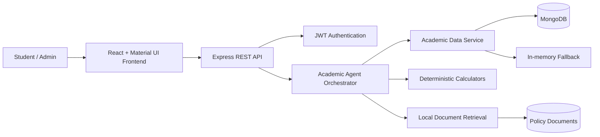

IOC ASSIGNMENT:
NAME: MAGESH GUMAR M
ROLLNO: 2023103612
PROJECT: College Academic Agent
DEPLOYMENT LINK: https://ai-agent-magesh9.vercel.app?_vercel_share=wxA1AtpGHo1qoZzF6owOuV1lAcaRFgCV


# College Academic Agent

## 1. Executive Summary

The College Academic Agent is a full-stack academic support platform for students and academic administrators. It gives students a single interface for checking attendance, marks, assignments, timetables, examination eligibility, academic rules, and personalized study priorities.

The system combines authenticated APIs, deterministic academic calculations, document retrieval, agent orchestration, and a React dashboard. It is designed to provide evidence-based answers from student records instead of relying only on conversational text generation.

## 2. Problem Statement

Students often need information from several disconnected sources: attendance registers, internal marks, assignment schedules, timetables, academic calendars, and institutional policies. This creates delays and makes it difficult to understand what action should be taken next.

The project solves this problem by providing:

- One authenticated academic assistant.
- Direct access to student-specific academic records.
- Policy-aware answers for examination and attendance questions.
- Clear tool traces showing which records were checked.
- Visual summaries of attendance and recent marks.
- Actionable recommendations based on weak subjects, attendance risk, and deadlines.

## 3. Objectives

- Provide secure student and administrator authentication.
- Centralize academic information in a usable dashboard.
- Answer common student questions using verified application data.
- Calculate attendance and academic metrics deterministically.
- Retrieve relevant institutional rules from uploaded documents.
- Explain the information sources and tools used for each answer.
- Support future expansion to a production-grade AI model and persistent conversation storage.

## 4. System Architecture

### 4.1 Architecture Overview

The application uses a layered full-stack architecture:



### 4.2 Frontend Layer

The frontend is implemented with React, Vite, Material UI, React Router, and Axios.

Main responsibilities:

- Login and role-based navigation.
- Student dashboard and admin dashboard.
- Conversation creation and switching.
- Chat messages and Markdown rendering.
- Tool execution traces before or alongside responses.
- Attendance and marks charts.
- Recent semester marks table.
- Academic profile, assignments, and timetable display.

Important files:

- `frontend/src/App.jsx`: application routes, dashboards, chat, charts, and page behavior.
- `frontend/src/context/AuthContext.jsx`: login state, token persistence, and profile loading.
- `frontend/src/services/api.js`: Axios client and authorization headers.
- `frontend/src/App.css`: dashboard and chat styling.

### 4.3 Backend Layer

The backend is implemented with Node.js and Express.

Main responsibilities:

- API routing.
- JWT authentication and authorization.
- Student and administrator access control.
- Academic data retrieval.
- Chat request handling.
- Database connection and fallback behavior.

Important files:

- `backend/server.js`: server bootstrap and route registration.
- `backend/routes/authRoutes.js`: authentication endpoints.
- `backend/routes/studentRoutes.js`: student academic records.
- `backend/routes/adminRoutes.js`: administrator operations.
- `backend/routes/chatRoutes.js`: academic assistant endpoint.
- `backend/middleware/auth.js`: protected route middleware.
- `backend/config/db.js`: MongoDB connection and in-memory fallback.

### 4.4 Data Layer

The data service abstracts access to the following collections:

- `users`
- `students`
- `attendance`
- `marks`
- `assignments`
- `timetable`
- `academic_calendar`
- `documents`
- `conversations`
- `messages`

MongoDB is the primary persistence layer. If MongoDB is unavailable, the application uses seeded in-memory data so the local demonstration can still run.

## 5. Agent Workflow Design

### 5.1 Request Lifecycle

1. The student submits a question from the chat interface.
2. The frontend sends the request with the JWT access token.
3. The backend authenticates the student and identifies the student record.
4. The orchestrator classifies the question using intent and subject detection.
5. Required academic tools are executed.
6. Deterministic calculations are performed where numbers are involved.
7. Policy questions use local document retrieval.
8. The orchestrator builds a concise, evidence-based answer.
9. The response returns the answer, tool traces, optional source citation, student context, and session memory.
10. The frontend displays the answer and the checked records.

### 5.2 Supported Question Categories

- Attendance percentage by subject.
- Classes required to reach a target attendance percentage.
- Examination eligibility based on attendance rules.
- Marks, average score, strongest subject, and weakest subject.
- Pending assignments and deadlines.
- Timetable and upcoming classes.
- Academic calendar and examination dates.
- College rules and regulations.
- Personalized weekly study focus.
- Suggestions based on low marks, low attendance, and assignment pressure.

### 5.3 Tool Trace Examples

The interface can show messages such as:

- `Checking your attendance records...`
- `Checking your assessment records...`
- `Checking your pending assignments...`
- `Checking your class schedule...`
- `Searching the official college regulations...`
- `Calculating how many classes you need to reach the target attendance...`

This makes the answer process visible and helps students understand why a recommendation was made.

### 5.4 Agent Tools

| Tool | Purpose |
|---|---|
| `getAttendance` | Retrieves attendance records for the authenticated student. |
| `getMarks` | Retrieves subject marks and calculates academic summaries. |
| `getAssignments` | Finds pending assignments and orders them by deadline. |
| `getTimetable` | Finds classes for the student or requested date. |
| `getAcademicCalendar` | Retrieves semester, examination, holiday, and deadline dates. |
| `searchCollegeDocuments` | Searches uploaded policy and regulation documents. |
| `calculateAttendance` | Calculates classes required to reach a target percentage. |

## 6. Academic Calculations

Numerical results are generated by deterministic utility functions instead of being invented by a language model.

Examples include:

- Attendance percentage.
- Average marks.
- Classes required to reach 75% attendance.
- Attendance after additional classes.
- Required final examination score.
- Days remaining until an academic date.

For attendance, the current percentage is based on attended classes divided by total classes:

$$
Attendance\ Percentage = \frac{Classes\ Attended}{Total\ Classes} \times 100
$$

## 7. Security Model

### 7.1 Identity and Authentication

- Users authenticate with email and password.
- Passwords are stored as bcrypt hashes.
- Successful login returns a JWT token.
- The frontend sends the token in the `Authorization` header.

### 7.2 Authorization

- Student routes require an authenticated student token.
- Student data is scoped to the authenticated student ID.
- Administrator routes require the administrator role.
- Protected frontend routes redirect unauthenticated users to the login page.

### 7.3 Data Protection

- Local `.env` files are excluded from Git.
- `.env.example` documents expected environment variables without exposing secrets.
- Academic data should be encrypted in transit and at rest in production.
- Production deployments should use a managed secret store instead of committed credentials.

### 7.4 Guardrails

- Policy answers should cite the relevant uploaded document when available.
- Numerical academic results should come from application calculations.
- Students should only access their own academic records.
- Missing or ambiguous data should be reported instead of guessed.

## 8. Deployment Strategy

### 8.1 Local Development

Backend:

```powershell
npm install
npm run dev
```

Frontend:

```powershell
cd frontend
npm install
npm run dev
```

Default local services:

- Backend: `http://localhost:5000`
- Frontend: `http://localhost:5173`
- MongoDB: `mongodb://127.0.0.1:27017`

### 8.2 Production Deployment

A production deployment can use:

- React frontend hosted on a static hosting platform or CDN.
- Express backend deployed as a container or managed Node.js service.
- MongoDB Atlas for persistent academic data.
- HTTPS through a reverse proxy or cloud load balancer.
- Environment-specific configuration for database URL, JWT secret, and allowed origins.
- Centralized logs and health checks.

### 8.3 Scaling Considerations

- Add database indexes for `studentId`, `email`, and document search fields.
- Store conversations and messages in MongoDB instead of process memory.
- Add Redis or another shared session/cache layer for multiple backend instances.
- Separate document indexing from request handling.
- Use background workers for large document ingestion.
- Add rate limiting and request validation at the API boundary.

## 9. Monitoring Dashboard Design

A production monitoring dashboard should track five categories:

### Health

- Backend availability.
- MongoDB connectivity.
- Frontend availability.
- API response status codes.

### Trace

- Request latency.
- Agent tool execution time.
- Document retrieval duration.
- Database query duration.

### Quality

- Answer success rate.
- Fallback response rate.
- Policy citation coverage.
- User feedback score.
- Incorrect or unresolved question count.

### Safety

- Unauthorized access attempts.
- Rejected requests.
- Suspicious activity.
- Policy search failures.
- Sensitive data exposure alerts.

### Cost and Business Outcomes

- Requests per student.
- Active students and administrators.
- Most-used tools.
- Attendance-risk interventions.
- Assignment completion support.
- Average time saved per academic query.

## 10. Testing and Validation

The project has been validated through:

- Frontend production build with Vite.
- Student login using demo credentials.
- Administrator login using demo credentials.
- Authenticated chat requests.
- Attendance query and tool trace verification.
- Personalized weekly study-focus query.
- MongoDB data access and in-memory fallback behavior.
- Git repository push and branch tracking.

Recommended additional tests:

- Unit tests for every calculator.
- API tests for role-based access control.
- Tests for missing student records.
- Tests for empty assignments and timetable data.
- Tests for policy questions with no matching document.
- Browser tests for conversation switching and responsive layouts.
- Security tests for expired and manipulated JWT tokens.

## 11. Limitations

- The current agent uses deterministic orchestration and local retrieval rather than a live Ollama or hosted LLM integration.
- Conversation state is lightweight and should be persisted for production use.
- The administrator dashboard currently focuses on document upload and student viewing.
- The in-memory fallback is intended for local demonstration, not production persistence.
- Monitoring metrics and alerting require integration with an observability platform.

## 12. Future Enhancements

- Integrate Ollama or another approved LLM for natural-language generation.
- Add persistent conversation history and conversation deletion.
- Add administrator editing for attendance, marks, assignments, and timetables.
- Add notifications for low attendance and approaching deadlines.
- Add calendar synchronization.
- Add student feedback and answer correction workflows.
- Add role-based permissions for faculty, advisors, and administrators.
- Add multilingual support.
- Add automated report generation for students and faculty.
- Add containerized deployment with CI/CD.

## 13. Demo Credentials

Student:

- Email: `student@college.edu`
- Password: `student123`

Administrator:

- Email: `admin@college.edu`
- Password: `admin123`

## 14. Conclusion

The College Academic Agent demonstrates an end-to-end academic support platform with a React user interface, secure Express APIs, MongoDB-backed records, deterministic calculations, policy retrieval, and agent-style tool traces. Its architecture provides a practical foundation for expanding into a production system with live language models, persistent conversations, stronger administration, and operational monitoring.
